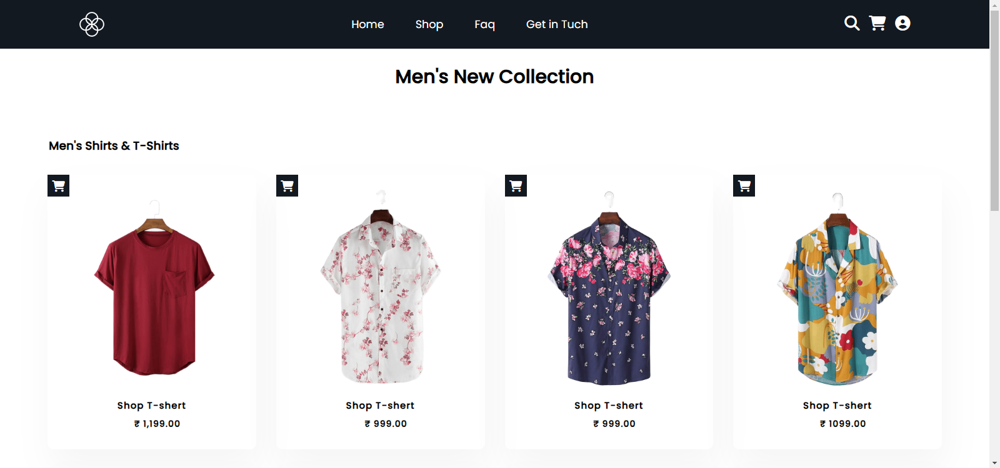

<div align="center">
  
  
  
  
  [](https://twitter.com/intent/follow?screen_name=techwanil)
 
  <br />

  <h2 align="center">Responsiv Ecommerce Website</h2>

 In this project, I have created a Ecommerce Website. The project was developed using HTML5 and CSS3.

  <a href="https://techwithanil.github.io/ecommerce-web-design/"><strong>➥ Live Demo</strong></a>

</div>

### Demo Screeshots



### Prerequisites

Before you begin, ensure you have met the following requirements:

* [Git](https://git-scm.com/downloads "Download Git") must be installed on your operating system.

### Run Locally

To run **Ecommerce Website** locally, run this command on your git bash:

Linux and macOS:

```bash
sudo git clone https://github.com/techwithanil/ecommerce-web-design.git
```

Windows:

```bash
git clone https://github.com/techwithanil/ecommerce-web-design.git
```

### Contact

If you want to contact me you can reach me at [Twitter](https://twitter.com/techwanil).
